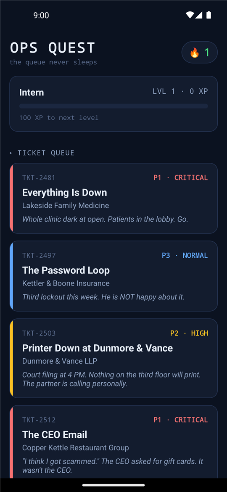
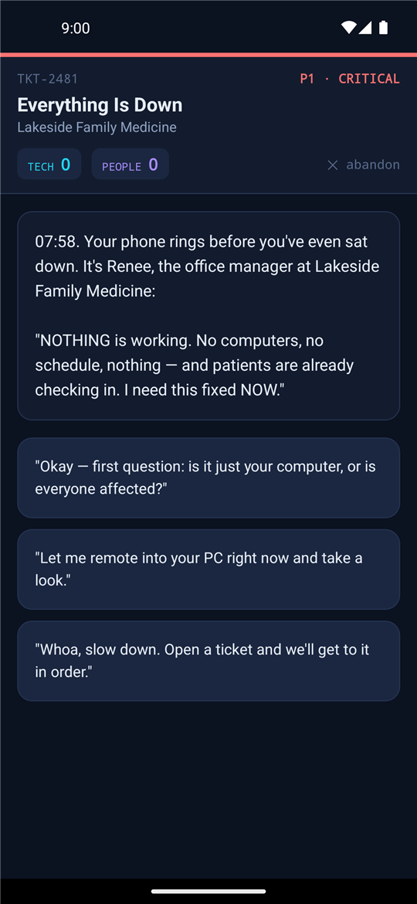
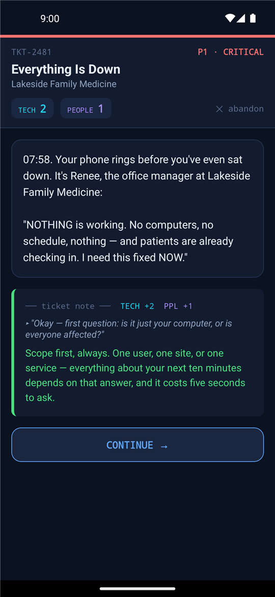
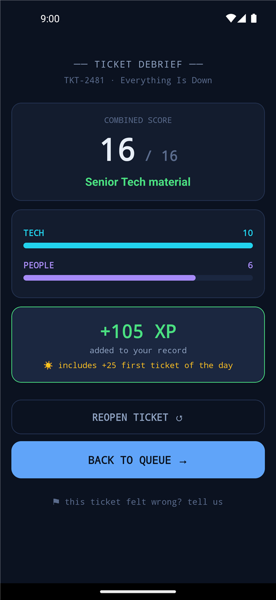

# OpsQuest

**The IT support simulator you want to answer.**

OpsQuest is a bite-sized training game for help desk teams, MSPs, and anyone learning how to handle real support tickets with both technical judgment and people skills.


[View the landing page](docs/) | [Download the Android APK](https://github.com/Spillers-Technology/OpsQuest/releases) | [Request trial access](mailto:help@spillerstech.us?subject=OpsQuest%20public%20trial%20access)

## Public Trial

OpsQuest is preparing for its first Play Store release. Email [help@spillerstech.us](mailto:help@spillerstech.us) to request access to the public trial and help us qualify OpsQuest for the Play Store launch.

## What It Is

OpsQuest turns help desk training into playable branching tickets. Players triage outages, calm frustrated callers, verify identity before password resets, write useful ticket notes, and learn when to escalate.

Every decision is scored across two tracks:

- **Tech**: troubleshooting order, risk control, escalation judgment, and root-cause thinking.
- **People**: empathy, urgency, clear communication, security confidence, and follow-through.

Because the technically correct answer delivered badly is still a failed ticket.

## Inside 0.1.0

- **20 branching scenarios** across 10 categories (networking, security, printers, email, hardware, change management, comms, backup, escalation, onboarding) and four priority tiers — P1 critical down to P4 routine judgment calls. Choices have consequences: different paths, different endings.
- **A living ticket queue**: 8 tickets a day, balanced by priority and length, rotated daily with a "pull more" refresh. Short, medium, and long scenarios so a session fits the time you have.
- **Two difficulty modes**, chosen on first open and switchable anytime: **Assisted** (category tags + a senior-tech hint at every decision) and **Real Tech** (tickets exactly as they arrive: "HELP, JOHN", no tags, no hints).
- **Fully animated play**: typewriter ticket prose, reactive scoring with haptics, screen-edge quality flashes, and a sequenced debrief reveal.
- **Dual Scoring**: separate Tech and People points make the soft skills visible without watering down the technical work.
- **Skill Bites**: short quiz drills for fundamentals, ticket craft, and security habits — with hints in Assisted mode.
- **XP, Streaks, and a Daily Bonus**: lightweight progression, a streak flame, and +25 XP for the first ticket you close each day.
- **Local-first, server-optional**: no account required and everything works offline. Point the app at an optional self-hosted content server to pull new scenarios as they're published (see [Content Server](#content-server)).
- **JSON scenario authoring**: scenarios are plain JSON with a documented format ([AUTHORING.md](AUTHORING.md)) and a validator (`npm run validate`) — write content without touching code.

### Screenshots

<p align="center">
  
  
  
  
</p>

### Ticket queue (20 scenarios)

Highlights from the wave-1 content set:

- **Everything Is Down** (P1, networking): a clinic outage with patients in the lobby, dead agents, a failed UPS, and a very real communication clock.
- **Friday Ransomware Report** (P1, security, long): 4:45 PM, weird extensions, a ransom note — isolate first, preserve evidence, protect the backups.
- **File Server Dead — Restore Under Fire** (P1, backup, long): a dying RAID, four days of backups that lied, and a restore you'd better verify first.
- **Misrouted Contact on an ERP Outage** (P2, comms, long): the ticket says "HELP, JOHN". The contact card is the wrong John. The CFO is waiting.
- **Firewall Firmware: Now or Never?** (P4, change-mgmt): the same patch is a six-minute yes for a print shop and a change-request no for a credit union.
- **The Office-Store Switch** (P4, networking): a $20 "internet splitter", a helpful cable-tidier, and the broadcast storm they made together.

...plus vendor blame games, vanishing emails, a dead laptop 40 minutes before an investor keynote, a Monday new hire nobody provisioned, and more.

### Skill Bite decks (3)

- **Networking First Steps**: ping, DNS, DHCP, APIPA — the first five minutes of an "internet is broken" call.
- **Ticket Craft**: notes worth reading, SLA response vs. resolution, escalations that aren't hot potatoes.
- **Security Basics**: phishing tells, MFA, least privilege, callback verification.

## Who It Is For

OpsQuest is for new help desk technicians, MSP service teams, team leads building training habits, and anyone who wants support practice that feels closer to the queue than a slide deck.

It is especially useful for teaching:

- How to scope incidents before touching the keyboard.
- How to communicate during urgent outages.
- Why password resets need identity verification.
- How to turn repeat tickets into root-cause fixes.
- What useful ticket notes actually look like.

## Android Release

Android APKs are available from GitHub Releases:

- Package: `com.opsquest.app`
- Current version name: `0.1.0`
- Current version code: `6`
- Releases: <https://github.com/Spillers-Technology/OpsQuest/releases>

## Run Locally

OpsQuest is built with Expo and React Native.

```bash
npm install
npx expo start
```

Then scan the QR code with Expo Go, or run on Android:

```bash
npx expo start --android
```

## Content Server

OpsQuest works fully offline, but teams can self-host the optional content server
([`server/`](server/)) to publish new scenarios to the app over time: players just paste
the server URL in Settings — no accounts needed to read. The server ships with a
web-based scenario editor (`/admin`) with local accounts, RBAC, and optional OIDC/SAML.

Container images are published to GHCR (`ghcr.io/spillers-technology/opsquest-server`).
See [server/README.md](server/README.md) for Docker Compose and Kubernetes deployment.

## Website

The product landing page lives in [`docs/`](docs/) for GitHub Pages.

When Pages is enabled for the public repo, it is intended to publish from the `docs` folder.

## Roadmap

Near-term work is focused on more ticket content, better scoring balance, and public trial feedback.

Planned next steps:

- More MSP-flavored scenarios across networking, printing, phishing, access, and escalation.
- More Skill Bite decks for networking, ticket craft, and security basics.
- Shareable results and lightweight feedback from testers.
- Public trial polish for the Play Store path.

## Contributing

Worked a real support queue? Scenario, coaching, accessibility, and app
contributions are welcome. [CONTRIBUTING.md](CONTRIBUTING.md) explains the
content principles, fictional-data requirement, and review steps.

## License

OpsQuest is released under the [MIT License](LICENSE).
